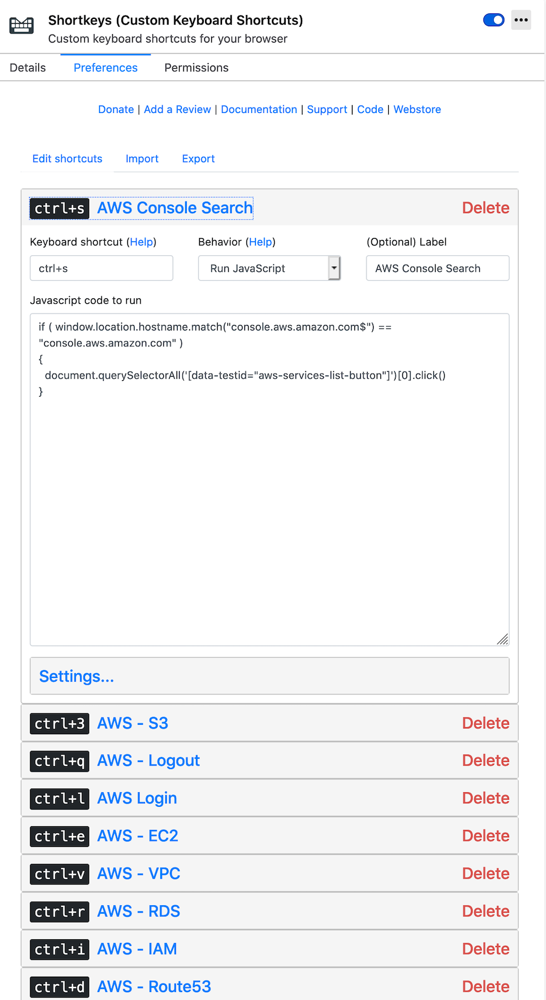

# shortkeys

I'm using Shortkeys on [Firefox](https://addons.mozilla.org/en-GB/firefox/addon/shortkeys/) and [Chrome](https://chrome.google.com/webstore/detail/shortkeys-custom-keyboard/logpjaacgmcbpdkdchjiaagddngobkck) extension to navigate easily in AWS Console.

So, there is no way to automate to configure the extension, but, still good to keep the it somewhere. At the same time, it's good to share.

**PS:** AWS has added a shortcut for search bar (Option+S) finally. CTRL+S is irrelevant now. Use that instead.

Example config;

**Firefox->Tools->Add-ons->Extensions->Shortkeys->Preferences**

